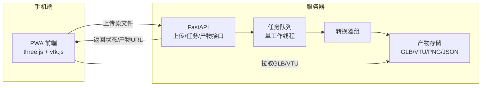
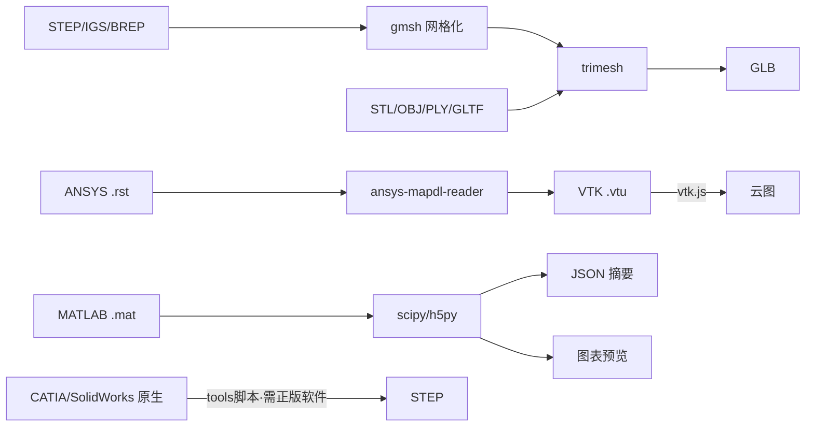

# 架构说明

## 总体架构



## 转换管线



## 格式选择依据

- **GLB（glTF 二进制）**：工业级 3D 传输标准，three.js/model-viewer 原生支持，
  移动端 GPU 友好，支持多零部件层级。
- **VTK(.vtu)**：ANSYS 结果网格的事实标准，vtk.js（Kitware 官方）可直接渲染
  应力/位移云图，支持场量切换与标量条。
- **PNG + JSON**：MATLAB 数据最轻量的展示方式，曲线/热图由服务端 matplotlib 预渲染。

## 转换任务状态机

```
pending → converting → done
                   ↘ error（含失败原因，前端展示引导）
```

- 上传：分块写盘，落盘后再入队，避免竞态
- 单工作线程串行转换（MVP），后续可换 Celery/Redis 多机扩展
- 大网格自动二次误差减面（>80万面时），保证手机端流畅

## 安全与限制

- 上传限 1GB/文件；转换在隔离容器内执行
- 不做代码执行/宏解析（防恶意 .mat/.cdb）
- 私有格式解析依赖许可证合规的转换步骤（原生CAD → STEP 在用户 CAD 机器上完成）
